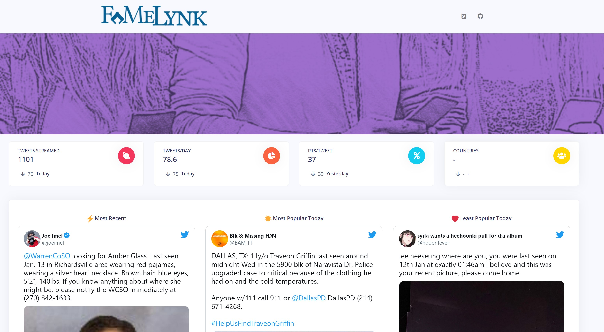

# faMeLynk

# FaMeLynk \| Connecting Families and Friends

## Check It Out

-   Try a demo of the app on [shinyapps.io](https://gadenbuie.shinyapps.io/tweet-conf-dash/) or [my personal webpage](https://apps.garrickadenbuie.com/rstudioconf-2019/).

This dashboard is designed to provide a clean, accessible, hyper-focused interface to explore and monitor tweets sent during a conference, event, or gathering (IRL or online).

Currently, the dashboard includes the following tabs and features. The opening page show a few statistics about the current volume of tweeting about the conference. If the conference is part of a larger Twitter community, you can also display overall statistics about tweeting in that community. For example, **rstudio::conf** tweets are from members of the broader **\#rstats** Twitter community.

## What's New

*22 January 2022*:

    - Plot has been updated
    
    - Plot has been updated

*18 January 2022*:

    - Plot has been updated
    
    - Plot has been updated

## :pray: Thank you!

This dashboard was built using many great tools in the R ecosystem. Thanks to all of the developers of these open source packages:

-   [shiny](http://shiny.rstudio.com/)
-   [rtweet](https://rtweet.info)
-   [shinydashboard](https://rstudio.github.io/shinydashboard/)
-   [plotly](https://plot.ly/)
-   [tidyverse](https://tidyverse.org)
-   [shinycssloaders](https://github.com/andrewsali/shinycssloaders)
-   [DT](https://rstudio.github.io/DT/)
-   [shinyThings](https://github.com/gadenbuie/shinythings) - [shiny](http://shiny.rstudio.com/) modules for pagination and dropdown buttons.

-   [adminlte-ocean-next](https://github.com/gadenbuie/AdminLTE/tree/ocean-next) - An [AdminLTE](https://adminlte.io/) dashboard color theme.

...and many more. For a full list of project dependencies, see [deps.yaml](deps.yaml).

------------------------------------------------------------------------
This dashboard was built by [Emmanuel Olamijuwon](https://e.olamijuwon.com).